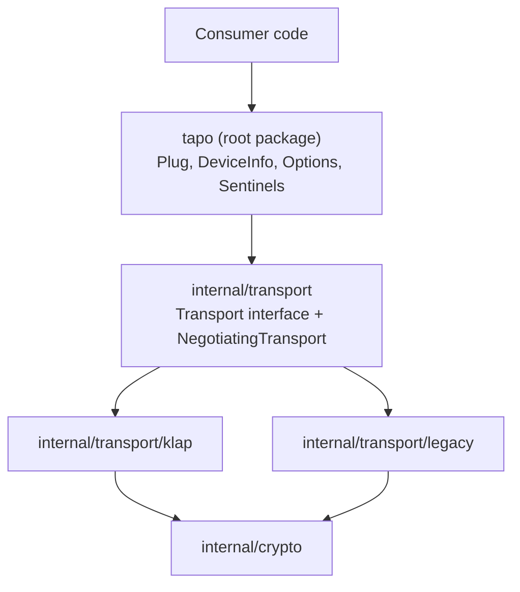
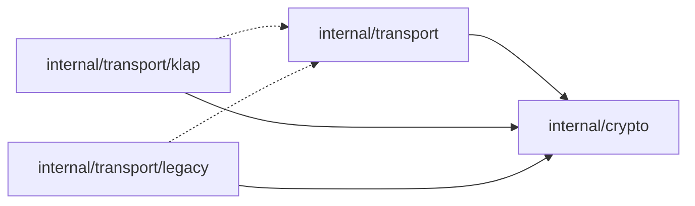

# Architecture Spine — tapo

## Design Paradigm

**Layered with `internal/` packages and an internal `Transport` interface.**

Root package (`github.com/mjenh/tapo`) exports the public API. Transport protocol implementations live behind `internal/`, invisible to consumers. A `Transport` interface at the internal boundary decouples `Plug` from protocol specifics while keeping the interface out of the public contract.



## Invariants & Rules

### AD-1 — Layered with internal boundary

- **Binds:** all
- **Prevents:** Transport implementation details leaking into the public API surface; consumers depending on protocol internals.
- **Rule:** All transport and crypto code lives under `internal/`. The root package imports `internal/transport` only. No `internal/` type appears in any exported signature.

### AD-2 — Package split: transport and crypto

- **Binds:** CAP-2, CAP-9
- **Prevents:** Duplicated crypto helpers across KLAP and legacy implementations.
- **Rule:** `internal/transport` owns the `Transport` interface and protocol-specific implementations (one sub-package each: `klap`, `legacy`). `internal/crypto` owns shared primitives (AES key derivation, MD5/SHA1 auth hashing, RSA helpers). Transport packages import crypto; crypto never imports transport.



### AD-3 — Thin Transport interface

- **Binds:** CAP-2, CAP-4, CAP-5, CAP-6, CAP-7, CAP-9
- **Prevents:** Command-building logic duplicated across transport implementations; interface growth as commands are added.
- **Rule:** `Transport` exposes two methods: `Login(ctx context.Context, email, password string) error` and `Send(ctx context.Context, method string, payload json.RawMessage) (json.RawMessage, error)`. `Plug` builds command JSON; transport handles encryption, session cookies, and wire format. Adding a new Tapo command never changes the `Transport` interface.

### AD-4 — Transport-owned session state

- **Binds:** CAP-2, CAP-9, CAP-10
- **Prevents:** Forcing a common session struct across protocols with incompatible session shapes (KLAP: seed + AES keys + sequence counter; legacy: RSA-derived token).
- **Rule:** Each `Transport` implementation holds its own session state internally. `Plug` queries login status and triggers re-auth on session-expiry errors but never inspects or stores session data. No session type crosses the `Transport` interface boundary.

### AD-5 — Mutex-based concurrency

- **Binds:** CAP-10
- **Prevents:** Race conditions on session state; redundant concurrent login storms on session expiry.
- **Rule:** Two mutex layers. (1) Each `Transport` implementation guards its session state with a `sync.Mutex`. (2) `Plug` holds a separate `sync.Mutex` gating re-authentication — on a session-expiry error, one goroutine re-auths while others block, then all retry with the fresh session. No `golang.org/x/sync` dependency.

### AD-6 — Sentinel errors with wrapping

- **Binds:** CAP-2, CAP-4, CAP-5, CAP-6, CAP-7, CAP-8
- **Prevents:** Callers needing `errors.As` and typed structs to discriminate error categories; over-engineering the v1 error surface.
- **Rule:** Four package-level sentinel `var`s: `ErrAuth`, `ErrTimeout`, `ErrUnsupportedModel`, `ErrHandshake`. Internal code wraps them with context via `fmt.Errorf("...: %w", sentinel)`. Callers use `errors.Is`. Typed error structs may be introduced in a minor version; sentinels remain stable.

### AD-7 — Lazy transport negotiation

- **Binds:** CAP-1, CAP-2, CAP-9
- **Prevents:** Coupling construction to network I/O; forcing callers to handle connection errors at construction time.
- **Rule:** `NewPlug` returns immediately with no network I/O. Negotiation is owned by a composite `NegotiatingTransport` inside `internal/transport` that implements the `Transport` interface. On the first `Login` call it attempts KLAP; on distinguishable protocol failure it retries legacy; the winning concrete transport is cached and used for all subsequent `Send` calls. `Plug` holds one `Transport` reference and calls `Login` once — it does not know about KLAP or legacy directly. `Option` overrides (force KLAP or force legacy) bypass `NegotiatingTransport` and inject the concrete transport directly. Negotiation is serialized by the Plug-level mutex (AD-5).

### AD-8 — DeviceInfo decoding in root package

- **Binds:** CAP-7
- **Prevents:** Unnecessary internal package for a small amount of JSON-to-struct mapping tied directly to a public type.
- **Rule:** `Plug.DeviceInfo()` deserializes the JSON response from `Transport.Send` into the public `DeviceInfo` struct and decodes base64 fields (Nickname, SSID) to UTF-8 in one pass. No `internal/device` package.

## Consistency Conventions

| Concern | Convention |
| --- | --- |
| Naming | Go stdlib conventions. Exported types: `Plug`, `DeviceInfo`, `Option`. Sentinels: `Err` prefix. Internal packages: lowercase, short. |
| Error shapes | All errors wrap a sentinel via `%w`. Context format: `"<component>: <detail>: %w"`. |
| Configuration | Functional options pattern: `type Option func(*config)`. Applied at `NewPlug` / `NewPlugFromEnv`. |
| Credentials | Never stored beyond the `Plug` struct's private fields. Never logged at any level, including debug. |
| Context | Every exported method takes `context.Context` as first parameter. Internal functions propagate it. |
| JSON | `encoding/json` only. Field tags on `DeviceInfo` match Tapo device JSON keys. Wire structs (command/response envelopes) are unexported. |
| HTTP | `net/http` stdlib client. One `http.Client` per `Transport` instance, configured with the Plug-level timeout. No global default client. |

## Stack

| Name | Version |
| --- | --- |
| Go | 1.24+ (minimum); 1.26.4 current stable |
| `net/http` | stdlib |
| `crypto/aes`, `crypto/cipher` (CBC) | stdlib |
| `crypto/rsa`, `crypto/sha1`, `crypto/md5` | stdlib |
| `encoding/json`, `encoding/base64` | stdlib |
| External dependencies | **None** |

## Structural Seed

```text
github.com/mjenh/tapo/
  plug.go              # Plug type, NewPlug, NewPlugFromEnv, TurnOn/Off/Toggle/DeviceInfo
  device_info.go       # DeviceInfo struct, base64 decoding, JSON mapping
  options.go           # Option type, WithTimeout, WithRetry, WithTransport
  errors.go            # Sentinel errors: ErrAuth, ErrTimeout, ErrUnsupportedModel, ErrHandshake
  doc.go               # Package doc comment
  internal/
    transport/
      transport.go     # Transport interface definition
      negotiate.go     # NegotiatingTransport: composite that tries KLAP then legacy
      klap/
        klap.go        # KLAP Transport implementation (handshake, session, send)
      legacy/
        legacy.go      # Legacy Transport implementation (RSA handshake, securePassthrough)
    crypto/
      crypto.go        # Shared: AES encrypt/decrypt, key/IV derivation
      auth.go          # Auth hash helpers (MD5 for KLAP, SHA1+base64 for legacy)
```

## Capability → Architecture Map

| Capability | Lives in | Governed by |
| --- | --- | --- |
| CAP-1: Construct client | `plug.go`, `options.go` | AD-1, AD-7 |
| CAP-2: Authenticate | `internal/transport/*` | AD-3, AD-4, AD-5 |
| CAP-3: Env construction | `plug.go` (NewPlugFromEnv) | AD-1 |
| CAP-4: Turn on | `plug.go` → `Transport.Send` | AD-3, AD-6 |
| CAP-5: Turn off | `plug.go` → `Transport.Send` | AD-3, AD-6 |
| CAP-6: Toggle | `plug.go` → `Transport.Send` | AD-3, AD-6 |
| CAP-7: DeviceInfo | `plug.go`, `device_info.go` | AD-3, AD-8 |
| CAP-8: Model warning | `plug.go`, `errors.go` | AD-6 |
| CAP-9: Transport negotiation | `internal/transport/negotiate.go` | AD-2, AD-7 |
| CAP-10: Goroutine safety | `plug.go` mutex, transport mutexes | AD-5 |

## Deferred

- **Per-command retry policy** — The spec mentions retry as an option but doesn't specify behavior. Deferred until real-world usage reveals whether retry belongs in `Plug` (command-level) or `Transport` (request-level). Can wait for v1 user feedback.
- **Structured logging** — Spec says optional debug mode. Shape of the logger interface (stdlib `log/slog` vs callback) deferred to implementation. No invariant needed — a single `debug bool` flag on the Plug config is sufficient for v1.
- **Connection pooling / HTTP client sharing** — Single Plug per host; no cross-host session sharing in v1. Deferred per spec non-goal.
- **Constant-time credential comparison** — Listed in spec deferred items. Revisit on security review.
- **RSA-1024 key size** — Tapo legacy protocol uses RSA-1024, which is exactly at Go 1.24's enforced minimum. Currently works but may break if Go raises the floor. Monitor across Go releases; no action until it breaks or a Tapo firmware update changes the key size.
